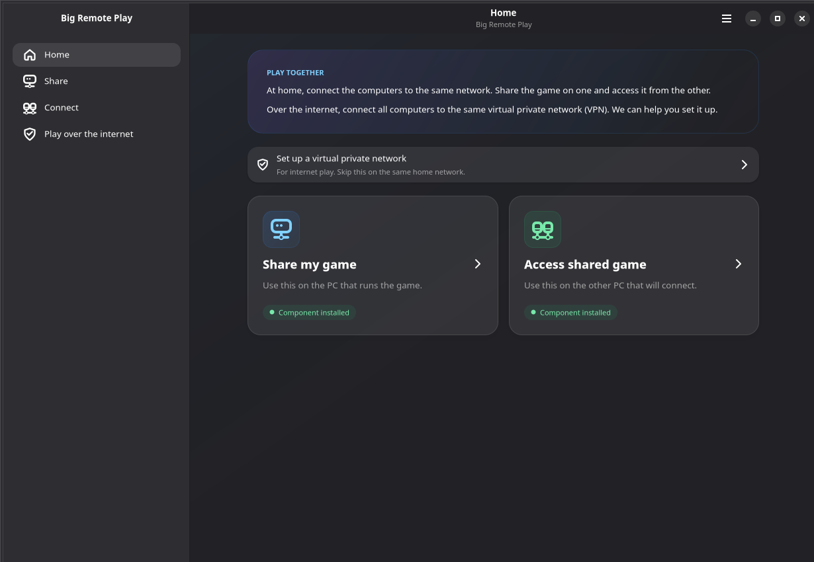
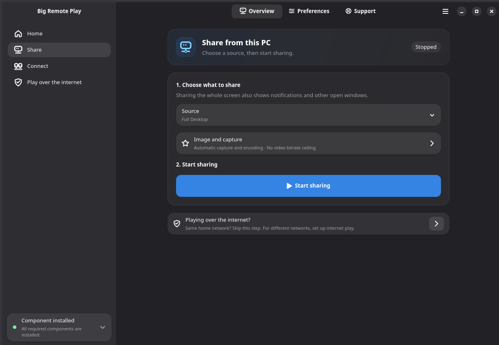
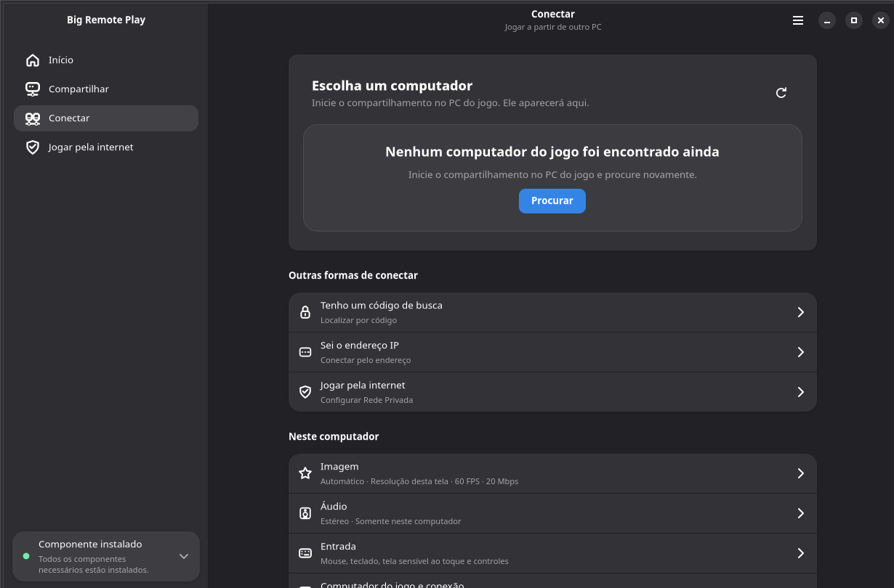
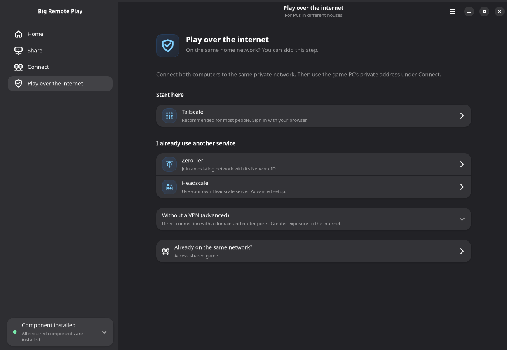

# Big Remote Play

<p align="center">
  <strong>Play together from anywhere, using the games and desktop you already have.</strong><br>
  A free-software GTK application that guides Sunshine, Moonlight and private-network setup from one place.
</p>

<p align="center">
  
  
  
  
</p>

<p align="center">
  <a href="docs/user-guide.md">User guide</a> ·
  <a href="docs/troubleshooting.md">Troubleshooting</a> ·
  <a href="CONTRIBUTING.md">Contribute</a>
</p>



## Why Big Remote Play?

Remote cooperative play on Linux often means learning several unrelated tools before the first connection works. Big Remote Play keeps those tools independent, but gives people one task-oriented interface for the complete journey:

- **Share a game or the whole desktop** with Sunshine.
- **Connect from another computer** with Moonlight.
- **Play across different networks** with Tailscale, Headscale or ZeroTier.
- **Preserve existing configuration** instead of replacing native game libraries, paired devices or network profiles.
- **Keep advanced controls available without showing them first** to people who only need the normal path.
- **Use an adaptive GTK 4/libadwaita interface** designed for keyboard, touch, compact windows, high contrast, large text, RTL and CJK layouts.

There is no proprietary game catalog and no requirement that the game came from a particular store. The game still runs on your own computer; Big Remote Play coordinates the surrounding free-software components.

## Try it in three steps

### 1. On the computer running the game

Open **Share my game**, choose a game or the desktop, then start sharing. Keep this computer running.

### 2. On the computer that will play

Open **Access shared game**, select the game computer and connect. On the first connection, Moonlight shows a four-digit pairing code. Enter that code on the sharing computer and approve the device.

### 3. When the computers are in different places

Open **Play over the internet** and place both computers on the same private network. Then return to Share or Connect. If discovery is unavailable on that network, connect using the game computer's private address.

> **Pairing code and search code are different.** A pairing code authorizes a device. A search code only helps locate a Big Remote Play computer on a network that permits discovery.

The full walkthrough, including audio, image quality, direct public access and safety limits, is in the [user guide](docs/user-guide.md).

## What the application brings together

| Goal | Big Remote Play guides | External component |
|---|---|---|
| Share a game or desktop | Capture, encoder, host limits, game library, pairing and server status | Sunshine |
| Access a shared computer | Discovery, manual address, image, audio, input and connection options | Moonlight Qt |
| Join a private network | Sign-in, account/network selection, status and recovery guidance | Tailscale, Headscale or ZeroTier |
| Keep credentials out of ordinary settings | Supported passwords and tokens through the desktop keyring | Secret Service |
| Diagnose configuration safely | Sanitized logs, explicit states and bounded checks | Native system tools |

Big Remote Play does not silently install components, expose the Sunshine administration panel, open internet ports or change the system audio output merely because a page was opened.

## Main flows

| Share | Connect | Private network |
|---|---|---|
|  |  |  |

The interface uses progressive disclosure: common actions remain visible, while capture backends, codecs, custom ports, VPN administration and other technical controls stay in clearly named secondary pages.

## Install or run

Prefer the BigLinux/Manjaro package when available. It installs the Python application, native resources, launcher, translations and system integration together.

To run a checkout after installing the native GTK requirements:

```bash
PYTHONPATH=src python3 -m big_remote_play
```

For an isolated editable environment that still uses the distribution's GI bindings:

```bash
uv venv --python /usr/bin/python3 --system-site-packages ../brp-dev-venv
uv pip install --python ../brp-dev-venv/bin/python --no-deps -e .
PYTHONPATH=src ../brp-dev-venv/bin/python -m big_remote_play
```

Requirements and packaging details are documented in the [development guide](docs/development.md). The Python wheel is not a complete desktop installation by itself because distribution resources live under `usr/share/`.

## Project status

The source tree includes automated checks for Python, GTK task flows, translations, desktop metadata, shell helpers, packaging and release hygiene. A stable release still requires target-machine validation of real streaming, GPU capture/encoding, audio routing, VPN authentication, PolicyKit, keyring behavior and assistive technologies. See [release acceptance](docs/release-testing.md).

Version fields in the checkout remain at `0.0.0`. Builds derive `YY.MM.DD` automatically from `SOURCE_DATE_EPOCH`, or from the current UTC date when no reproducible-build epoch is supplied. Maintainers do not edit version strings manually.

## Documentation

| Audience | Start here |
|---|---|
| Players and helpers | [User guide](docs/user-guide.md), [troubleshooting](docs/troubleshooting.md) |
| Contributors | [Contributing](CONTRIBUTING.md), [development](docs/development.md), [documentation index](docs/README.md) |
| UI contributors | [Iconography](docs/iconography.md), [UI instructions](src/big_remote_play/ui/AGENTS.md) |
| Maintainers | [Architecture](docs/architecture.md), [maintainer guide](docs/maintainer-guide.md), [release testing](docs/release-testing.md) |
| Coding agents | [AGENTS.md](AGENTS.md) |

## Contribute

Contributions are welcome in English or Portuguese. Useful starting points include:

- reproducing and documenting a bug;
- improving a confusing task flow;
- adding a focused regression test;
- testing real hardware or networks;
- reviewing one translation in context;
- improving screenshots or user documentation.

Read [CONTRIBUTING.md](CONTRIBUTING.md) before opening a pull request. Reports are only actionable with the versions, session type, network setup and sanitized evidence needed to reproduce the problem.

If Big Remote Play solves a problem for you, **star the repository**, test it on your hardware and share what worked. That feedback helps other Linux players discover the project and helps maintainers prioritize real-world compatibility.

## Security and privacy

Run the UI as your normal user. Pair only trusted computers. Sharing the whole desktop can expose notifications and other windows. Backups may contain private certificates and must be protected as secrets.

Never publish passwords, API tokens, authentication keys, private certificates, unredacted backups or private network addresses. Report sensitive vulnerabilities privately through the [security policy](https://github.com/biglinux/big-remote-play/security/policy), not a public issue.

## License and acknowledgements

Big Remote Play is licensed under **GPL-3.0-or-later**; see [COPYING](COPYING).

The project integrates with independently developed software, including Sunshine, Moonlight, Tailscale, Headscale and ZeroTier. Their names and trademarks belong to their respective projects. Big Remote Play does not replace their security models, protocols or upstream documentation.
