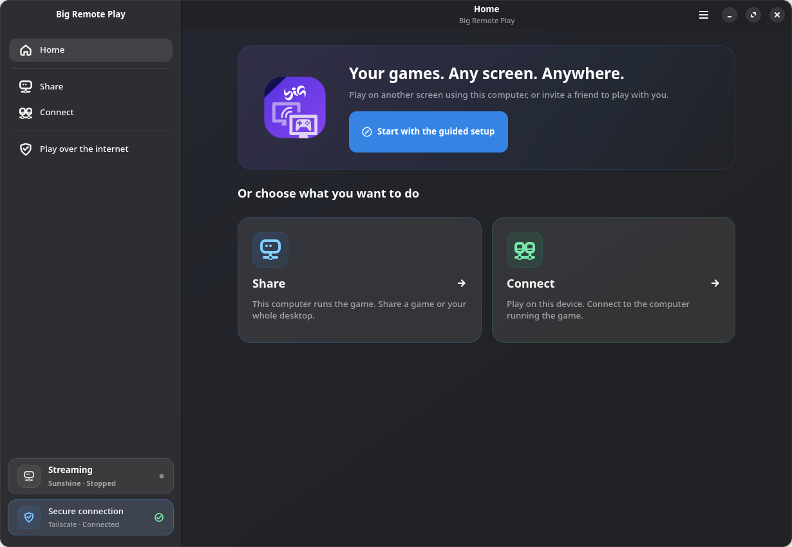
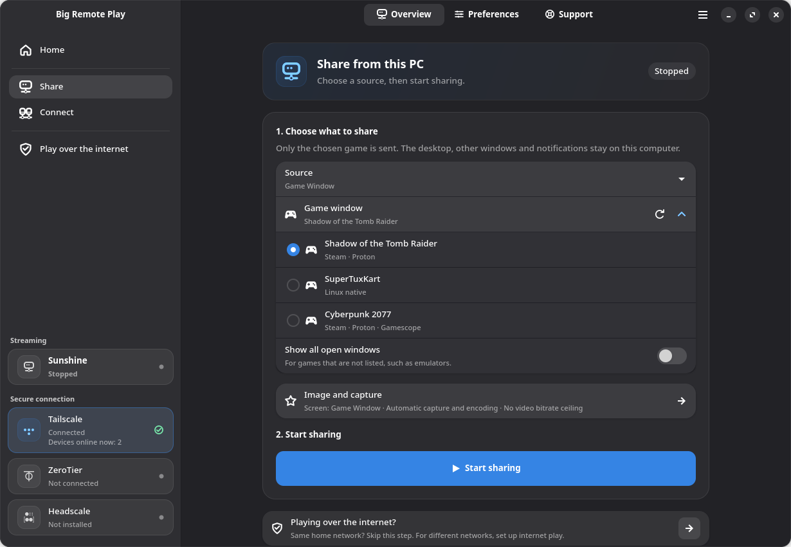
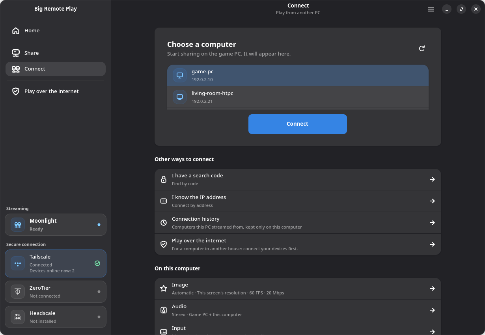
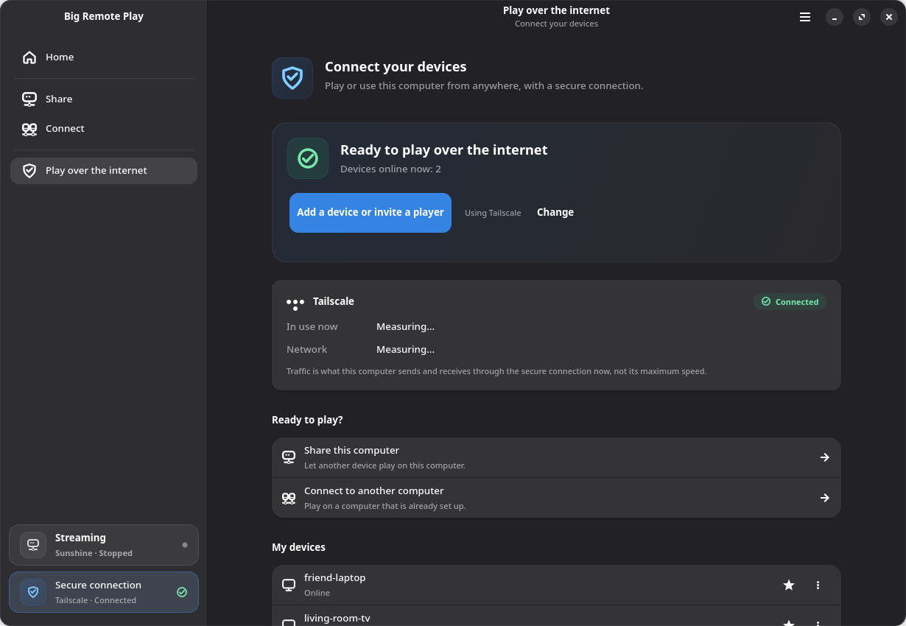
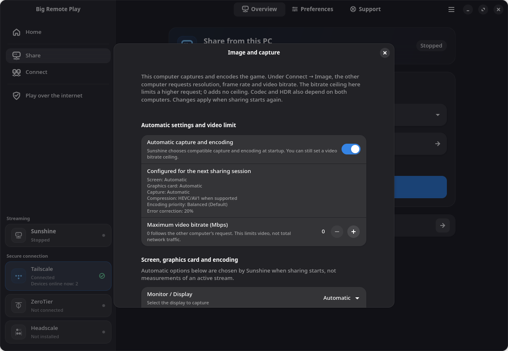
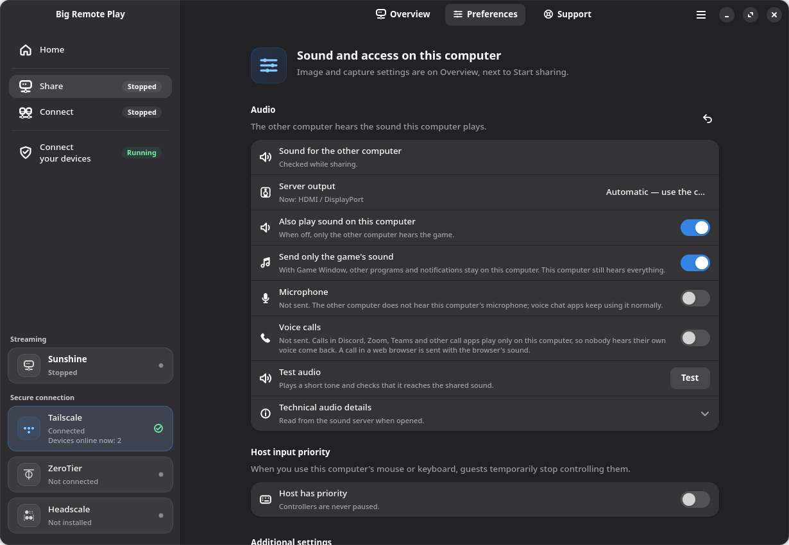
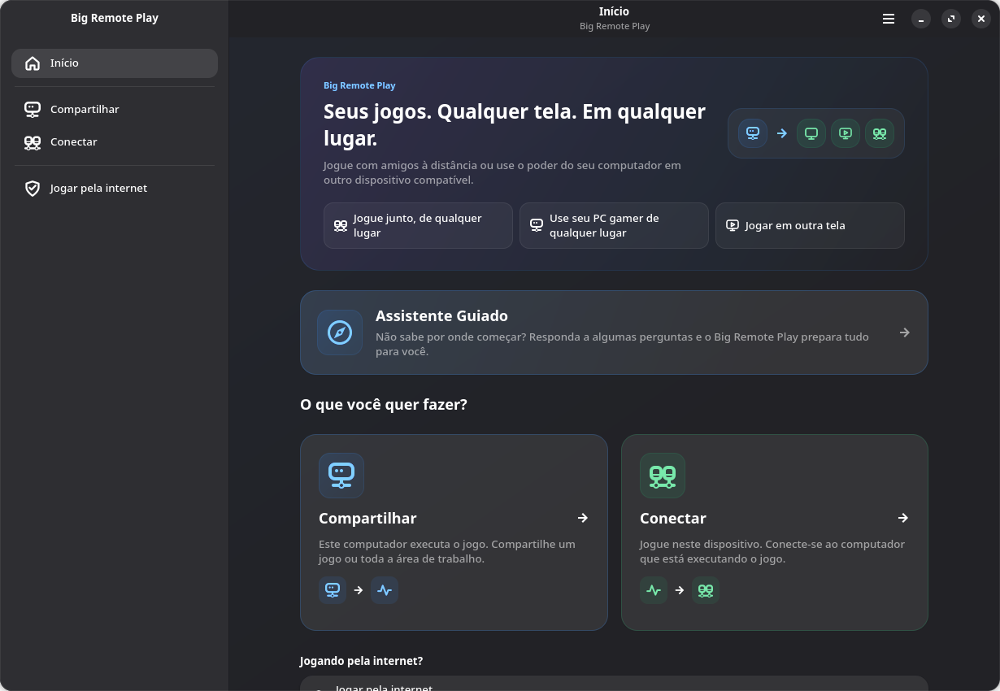
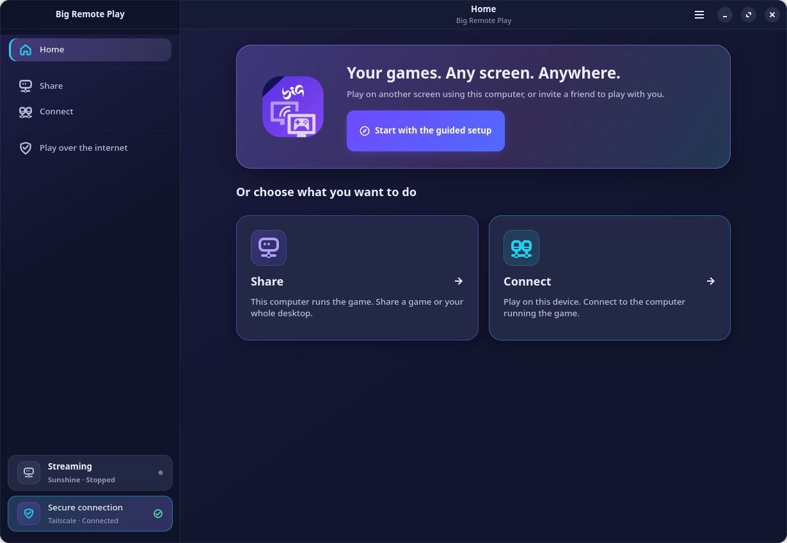
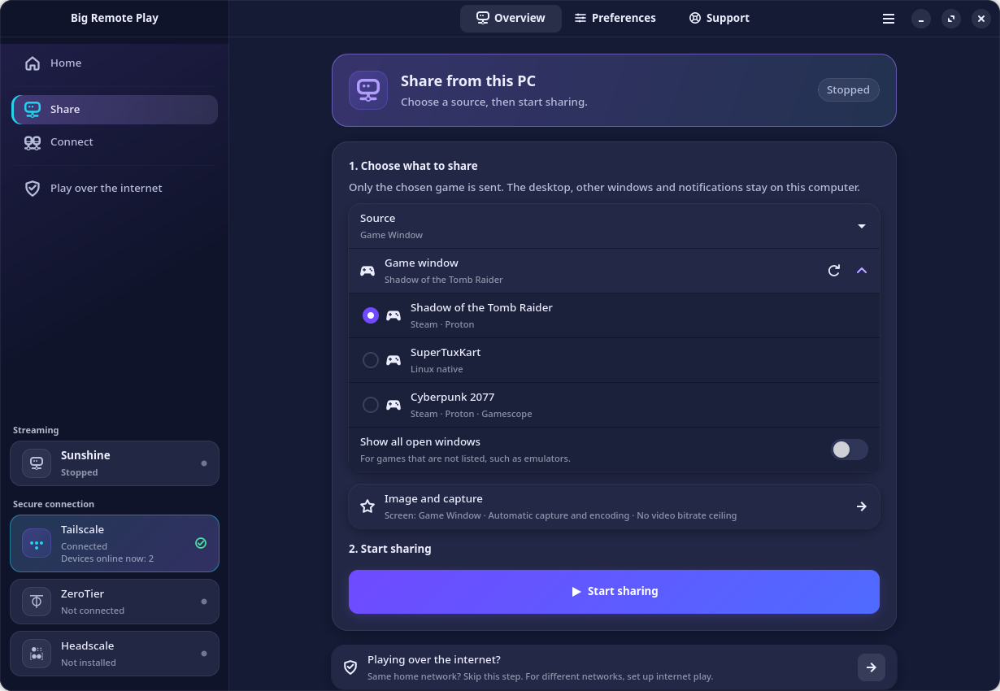
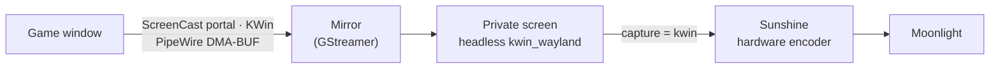

<p align="center">
  
</p>

<h3 align="center">Your games. Any screen. Anywhere.</h3>

<p align="center">
  Play with friends far away, or use the power of your computer on another device.<br>
  One friendly Linux app for Sunshine, Moonlight and secure private networks.
</p>

<p align="center">
  
  
  
  
  
  
</p>

<p align="center">
  <a href="#install">Install</a> ·
  <a href="docs/user-guide.md">User guide</a> ·
  <a href="docs/troubleshooting.md">Troubleshooting</a> ·
  <a href="#technologies">Technologies</a> ·
  <a href="CONTRIBUTING.md">Contribute</a>
</p>

<p align="center">
  
</p>

## Why Big Remote Play?

Remote play on Linux usually means learning several unrelated tools before the first connection works. Big Remote Play keeps those tools independent but gives you one task-oriented interface for the whole journey:

| | |
|---|---|
| 🎮 **Share a game** | Share the whole desktop with [Sunshine](https://github.com/LizardByte/Sunshine), start a Steam, Lutris or custom game, or send **only one game window**. |
| 🖥️ **Connect from anywhere** | Find the game computer and play it with [Moonlight](https://moonlight-stream.org/) on another PC, a TV or a laptop. |
| 🔒 **Play across the internet** | Put both computers on the same private network with Tailscale, Headscale or ZeroTier. No open router ports needed. |
| 🕵️ **Keep your desktop private** | **Game Window** streams one game through a private screen: notifications, chats and other windows never reach the other device. |
| 🧭 **Guided from the first click** | **Start with the guided setup** asks what you want to do and where the other device is, installs what this computer needs without a terminal, then opens the right page. |
| 🎮 **Controllers too** | Keyboard, mouse and controllers of the other device reach the game through Sunshine. While someone plays, **Share** says which controller arrived, or why none did. |
| 🔊 **Sound that just works** | Game audio is sent; the microphone and voice calls only when you turn them on. Everything returns to normal when sharing stops. |
| 🛡️ **Respects what you have** | Existing Sunshine libraries, paired devices, Moonlight identity and VPN profiles are preserved, never overwritten. |
| ♿ **Made for everyone** | Adaptive GTK 4/libadwaita interface for keyboard, touch, compact windows, high contrast, large text, RTL and CJK, in 32 languages. |

There is no proprietary game catalog and no requirement that the game came from a particular store. The game runs on your own computer; Big Remote Play coordinates the free-software components around it.

## Screenshots

<table>
  <tr>
    <td width="50%"><br><sub><b>Share</b>: choose Full Desktop, a game to start, or only one open game window.</sub></td>
    <td width="50%"><br><sub><b>Connect</b>: pick the game computer; other ways to connect are on the <b>Advanced options</b> tab.</sub></td>
  </tr>
  <tr>
    <td><br><sub><b>Connect your devices</b>: each method with a real switch, its address and its devices.</sub></td>
    <td><br><sub><b>Image and capture</b>: automatic by default, detailed when you need it.</sub></td>
  </tr>
  <tr>
    <td><br><sub><b>Sound</b>: what the other computer hears, said in plain words.</sub></td>
    <td><br><sub><b>32 languages</b>: here in Brazilian Portuguese.</sub></td>
  </tr>
  <tr>
    <td><br><sub><b>Gamer appearance</b>: a dark, colorful preset next to Automatic, Light and Dark.</sub></td>
    <td><br><sub><b>Game Window</b> in the Gamer appearance.</sub></td>
  </tr>
</table>

<sub>Screenshots use simulated games, devices and addresses.</sub>

## Try it in three steps

**1. On the computer running the game** — open **Share**, choose what to share and select **Start sharing**. Under **Source**, **Game Window** sends only the game you pick; **Full Desktop** sends the whole screen.

**2. On the computer that will play** — open **Connect** and choose the game computer. The first time, Moonlight shows a four-digit pairing code, and the sharing computer shows **New connection request** by itself: type the code there and choose **Approve**.

**3. When the computers are in different places** — open **Connect your devices**. Choose **Tailscale** (recommended), **ZeroTier** or **Headscale**: each opens its own page with one button for the next step (**Install and continue**, **Set up**, **Sign in**, **Start**), its devices with **Copy IP**, and **Add device**. Not sure where to start? **Start with the guided setup** on Home asks two questions, prepares this computer and takes you there.

> **Pairing code and search code are different.** A pairing code authorizes a device. A search code only helps find a Big Remote Play computer on a network that permits discovery.

The full walkthrough — audio, image quality, Game Window, direct public access and safety limits — is in the [user guide](docs/user-guide.md).

## Install

### BigLinux and Manjaro

Big Remote Play is packaged for BigLinux (currently in the `biglinux-testing` repository). The native package installs the application, launcher, icons, translations and desktop integration together:

```bash
sudo pacman -Syu big-remote-play
```

Then open the task you want: anything missing is listed in the app with **Install what's needed**, which installs it through Pamac or PolicyKit (your password is asked in the system's own window). It never installs software without that button. To install by hand instead:

```bash
sudo pacman -S --needed sunshine        # on the computer that shares games
sudo pacman -S --needed moonlight-qt    # on the computer that plays
```

### Arch Linux

Every dependency of the package is in Arch's own repositories; no extra repository has to be added. Moonlight, Tailscale, ZeroTier, Headscale and Caddy are in `extra`. Sunshine is not in the Arch repositories: on the computer that shares games, install it from the AUR or from Sunshine's own package first. **Install what's needed** says so instead of failing.

### Build the package from source

`makepkg` run inside a checkout packages that checkout:

```bash
git clone https://github.com/ruscher/big-remote-play.git
cd big-remote-play/pkgbuild
makepkg -si
```

Set `BIGREMOTEPLAY_FROM_GIT=1` to build `ruscher/main` instead of the local checkout. The package version is dated automatically at build time (`YY.MM.DD`).

### Nix

```bash
nix run github:biglinux/big-remote-play
```

The flake dates each build from its commit (`YY.MM.DD`), like the native package. It does not include GStreamer, so add its plugins to the environment to use Game Window. The PolicyKit helpers and their `/usr` paths are not installed by Nix: on NixOS the actions that need administrator rights (firewall rules, a Headscale server, host input priority) are unavailable.

### Run from a checkout

With the GTK requirements installed from your distribution:

```bash
PYTHONPATH=src python3 -m big_remote_play
```

For an isolated editable environment that still uses the distribution's GI bindings:

```bash
uv venv --python /usr/bin/python3 --system-site-packages ../brp-dev-venv
uv pip install --python ../brp-dev-venv/bin/python --no-deps -e .
PYTHONPATH=src ../brp-dev-venv/bin/python -m big_remote_play
```

The Python wheel alone is not a complete desktop installation: icons, styles, translations and helpers live under `usr/share/`. See the [development guide](docs/development.md).

### Requirements

| | Packages (Arch/BigLinux names) |
|---|---|
| **Required** | `python` ≥ 3.11, `gtk4`, `libadwaita` ≥ 1.7, `python-gobject`, `libsecret`, `avahi`, `curl`, `iproute2`, `iputils`, `jq`, `polkit`, `hicolor-icon-theme` |
| **Share** | `sunshine` |
| **Connect** | `moonlight-qt` |
| **Game Window** | Sunshine ≥ 2026.516; KDE Plasma (`kwin`, `xdg-desktop-portal-kde`) on Wayland or an X11 desktop with compositing; `gst-plugin-pipewire`, `gst-plugins-bad-libs`, `gst-plugins-good` |
| **Connect your devices** | one of `tailscale` or `zerotier-one`; to host your own Headscale server on this computer, `headscale` and `caddy` (`miniupnpc` reads the router's public address) |
| **Optional** | a Secret Service provider (GNOME Keyring or KWallet) for saved passwords, `libpulse` and `pipewire` for sound, `libkscreen` (screen mode and HDR for the connecting device), `pciutils` (graphics detection), `flatpak` (VPN clients installed as Flatpaks). Pamac is used to install components when it is present. |

## Game Window: share the game, not your desktop

Sunshine can only capture whole screens, so Game Window gives it a private one. A headless KWin screen holds nothing but a mirror of the chosen game; the desktop, panels, notifications and every window placed over the game simply do not exist there. If the game closes or crashes, sharing stops at once — it never falls back to the desktop.


```mermaid
flowchart LR
    G["Game window"] -->|"ScreenCast portal · KWin<br/>PipeWire DMA-BUF"| M["Mirror<br/>(GStreamer)"]
    M --> P["Private screen<br/>headless kwin_wayland"]
    P -->|"capture = kwin"| S["Sunshine<br/>hardware encoder"]
    S --> C["Moonlight"]
```

Games are listed by name from their process tree — Steam, Proton, Wine, Lutris, Heroic, Gamescope and native games — and the private screen runs at 240 Hz so the game picture is not held back. Design, safety rules, measurements and limits: [Game Window](docs/game-window.md).

## Technologies

| Area | What Big Remote Play uses |
|---|---|
| Language and UI | Python 3.11+, [GTK 4](https://gtk.org/), [libadwaita](https://gnome.pages.gitlab.gnome.org/libadwaita/), [PyGObject](https://pygobject.gnome.org/) |
| Streaming | [Sunshine](https://github.com/LizardByte/Sunshine) server (NVENC, VAAPI, Vulkan and software encoders) and [Moonlight Qt](https://github.com/moonlight-stream/moonlight-qt) client, configured through their native files and APIs |
| Game Window | [xdg-desktop-portal](https://flatpak.github.io/xdg-desktop-portal/) ScreenCast, [KWin](https://invent.kde.org/plasma/kwin) scripting and a headless `kwin_wayland`, [PipeWire](https://pipewire.org/) DMA-BUF, [GStreamer](https://gstreamer.freedesktop.org/); EWMH through `libX11` on X11 |
| Screen and colors | `kscreen-doctor` for HDR-to-SDR and per-session resolution, restored after every session |
| Audio | PipeWire/PulseAudio through `pactl` and `pw-link`: automatic output capture, voice calls kept out and the microphone left out unless you choose otherwise, PipeWire port links ("bridges") made by the app, which removes only what it created |
| Networks | mDNS discovery with [Avahi](https://avahi.org/); [Tailscale](https://tailscale.com/), [Headscale](https://headscale.net/) and [ZeroTier](https://www.zerotier.com/) clients and APIs |
| Security | Secret Service keyring (`libsecret`) for passwords and tokens, narrowly scoped PolicyKit helpers, ufw/firewalld checks, owner-only atomic writes |
| Internationalization | gettext, 32 translated catalogs (distinct `pt`/`pt_BR` and `zh_CN`/`zh_TW`) |
| Packaging | PEP 517 build on `uv_build`, private `/usr/lib/big-remote-play` layout that survives Python upgrades, PKGBUILD and Nix flake, reproducible `YY.MM.DD` versions |
| Quality | pytest (over 1,000 tests, GTK task flows under Xvfb and D-Bus), ruff, pyright, catalog and metadata validators |

How the pieces fit together is described in [architecture](docs/architecture.md) and the [host and network policy](docs/host-network-policy.md).

## Project status

The source tree runs automated checks for Python, GTK task flows, translations, desktop metadata, shell helpers, packaging and release hygiene. A stable release still requires target-machine validation of real streaming, GPU capture and encoding, audio routing, VPN sign-in, PolicyKit, keyring behavior and assistive technologies. See [release acceptance](docs/release-testing.md).

Version fields in the checkout stay at `0.0.0`. Builds derive `YY.MM.DD` automatically from `SOURCE_DATE_EPOCH`, or from the current UTC date when no reproducible-build epoch is supplied. Maintainers never edit version strings by hand.

## Documentation

| Audience | Start here |
|---|---|
| Players and helpers | [User guide](docs/user-guide.md), [troubleshooting](docs/troubleshooting.md), [Game Window](docs/game-window.md) |
| Playing over the internet | [Router, NAT and firewall](docs/router.md), [your own Headscale server](docs/vps-headscale.md), [Cloudflare](docs/cloudflare.md) |
| Contributors | [Contributing](CONTRIBUTING.md), [development](docs/development.md), [documentation index](docs/README.md) |
| UI contributors | [Visual design](docs/visual-design.md), [UI instructions](src/big_remote_play/ui/AGENTS.md) |
| Maintainers | [Architecture](docs/architecture.md), [maintainer guide](docs/maintainer-guide.md), [release testing](docs/release-testing.md) |
| Repository rules | [AGENTS.md](AGENTS.md) and the nested `AGENTS.md` files |

## Contribute

Contributions are welcome in English or Portuguese. Good starting points:

- reproduce and document a bug;
- improve a confusing task flow;
- add a focused regression test;
- test real hardware, games or networks;
- review a translation in context;
- improve screenshots or user documentation.

Read [CONTRIBUTING.md](CONTRIBUTING.md) before opening a pull request. Reports are actionable when they include the versions, session type, network setup and sanitized evidence needed to reproduce the problem.

If Big Remote Play helps you, **star the repository**, test it on your hardware and share what worked — that feedback helps other Linux players find the project and helps maintainers prioritize real-world compatibility.

## Security and privacy

Run the app as your normal user. Pair only trusted computers. **Full Desktop** can show notifications and other windows; use **Game Window** to send only the game. Backups may contain private certificates: protect them like passwords.

Never publish passwords, API tokens, authentication keys, private certificates, unredacted backups or private network addresses. Report sensitive vulnerabilities privately through the [security policy](https://github.com/biglinux/big-remote-play/security/policy), not a public issue.

## Credits

**Author / Lead Developer:** Rafael Ruscher

- **Development:** Rafael Ruscher, with contributions from Bruno Gonçalves, Tales A. Mendonça and everyone in the [contributors list](https://github.com/biglinux/big-remote-play/graphs/contributors), for the **[BigLinux](https://www.biglinux.com.br/)** community.
- **Translations, testing and feedback:** the BigLinux community, whose real computers, games and networks shape every release.

## Acknowledgements

Big Remote Play stands on the shoulders of excellent free software. Thank you to:

- **[LizardByte](https://github.com/LizardByte)** for Sunshine, and the **[Moonlight Game Streaming Project](https://moonlight-stream.org/)** for Moonlight — the streaming heart of this app;
- **[GNOME](https://www.gnome.org/)** for GTK, libadwaita and PyGObject;
- **[KDE](https://kde.org/)** for Plasma, KWin and xdg-desktop-portal-kde, which make Game Window possible;
- **[PipeWire](https://pipewire.org/)**, **[GStreamer](https://gstreamer.freedesktop.org/)**, **[freedesktop.org](https://www.freedesktop.org/)** and **[Avahi](https://avahi.org/)**;
- **[Tailscale](https://tailscale.com/)**, **[Headscale](https://github.com/juanfont/headscale)** and **[ZeroTier](https://www.zerotier.com/)** for private networking;
- **[Valve](https://www.valvesoftware.com/)** (Steam, Proton, Gamescope), **[Lutris](https://lutris.net/)**, **[Heroic](https://heroicgameslauncher.com/)** and **[Wine](https://www.winehq.org/)** for bringing so many games to Linux.

Their names and trademarks belong to their respective projects. Big Remote Play does not replace their security models, protocols or documentation.

## License

Big Remote Play is free software, licensed under **GPL-3.0-or-later**. See [COPYING](COPYING).
